# WeSmart Custom Cards — Home Assistant

A collection of custom cards for Home Assistant Dashboard, inspired by the **WeSmart AI** aesthetic: warm charcoal dark theme, orange accent, and minimal typography. No build step. No dependencies. Pure vanilla JS.

Three collections:
- **WeSmart Original** — fixed warm charcoal palette, production-ready
- **WeSmart InfiniteColor** — dynamic HSL color engine, palette from a single hex color, production-ready
- **WeSmart Labs** — experimental concepts, unstable, may change without notice

---

## Preview

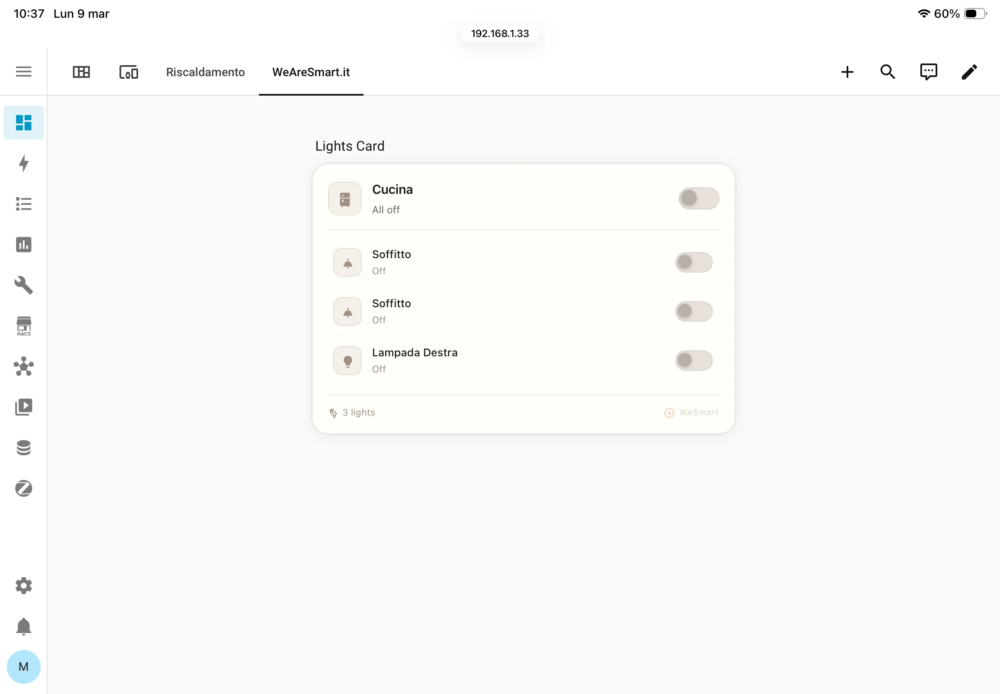
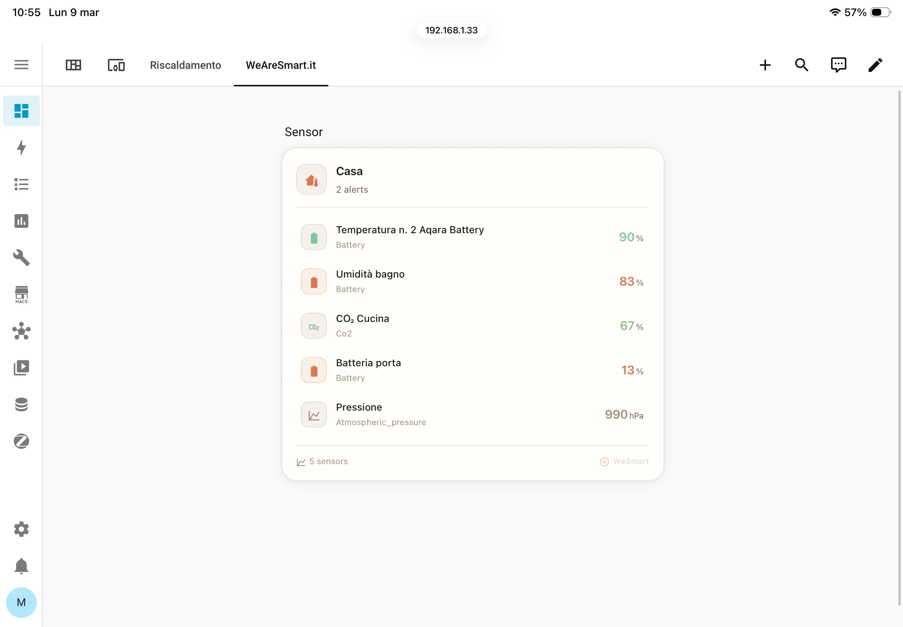
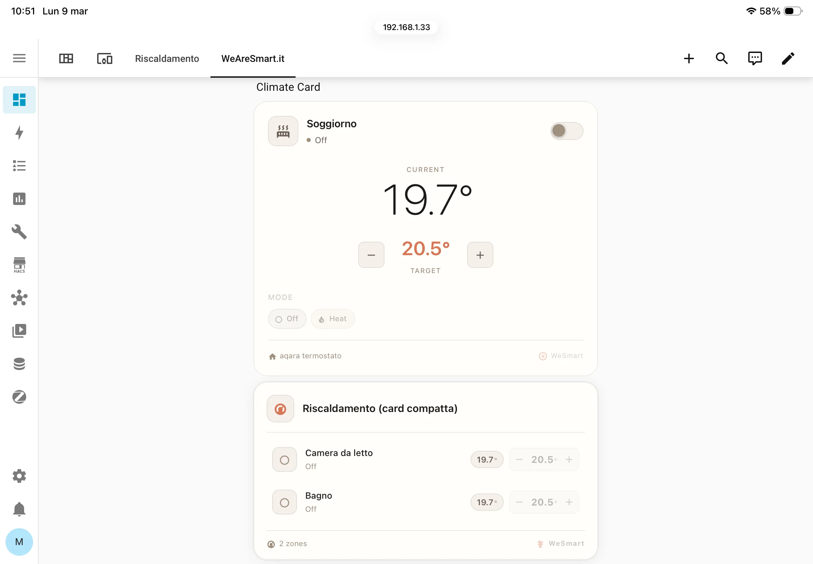

---

## WeSmart InfiniteColor

The **InfiniteColor** collection features a chromatic engine that generates a complete visual palette from a single hex color defined in YAML. Every background, surface, text shade, accent, shadow, and multi-entity line color is automatically derived — no hardcoded values anywhere.

```yaml
color: '#60B4D8'  ──→  accent, accent-soft
                  ──→  bg, surface, border
                  ──→  text, text-muted, text-dim
                  ──→  shadow, row-hover, pill-bg
```

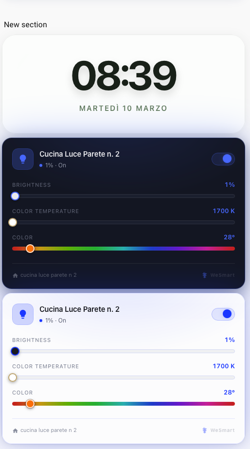
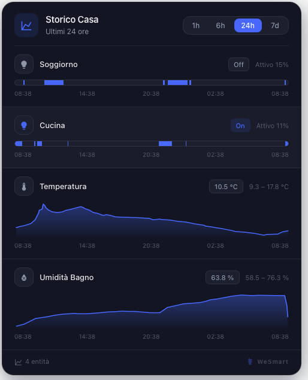

<details>
<summary>More InfiniteColor previews</summary>

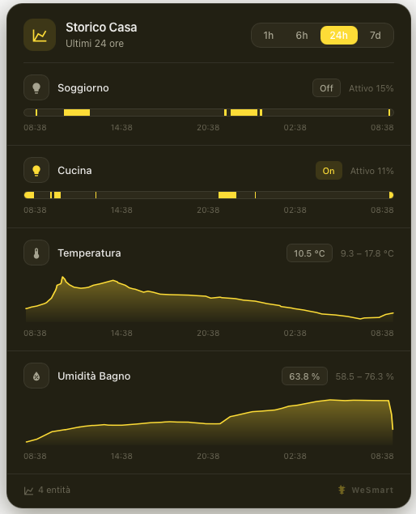
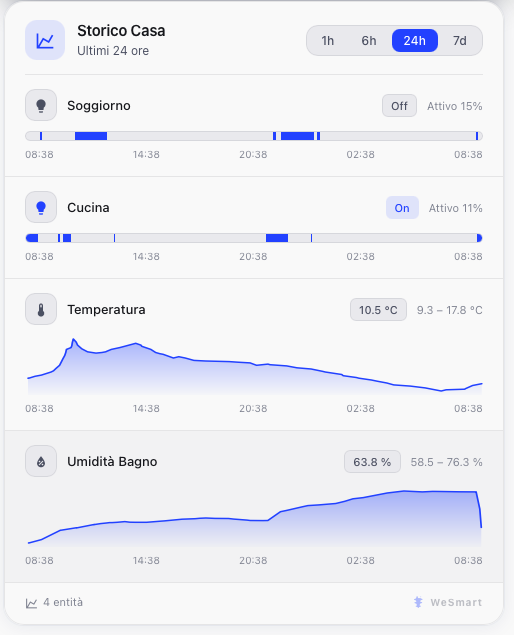

</details>

Pick any hex color and all InfiniteColor cards instantly adapt their entire visual palette:

| Input color | Palette |
|---|---|
| `'#D97757'` | Orange/charcoal — WeSmart default |
| `'#60B4D8'` | Cool blue — ideal for climate/temperature |
| `'#7CB87A'` | Green — ideal for doors/security |
| `'#A78BFA'` | Purple — ideal for scenes/automations |
| `'#F59E0B'` | Amber/gold — ideal for sensors/battery |
| `'#EC4899'` | Pink |
| `'#14B8A6'` | Teal/seafoam |

Themes `dark`, `light`, and `auto` (follows OS `prefers-color-scheme` in real time) are supported by every card.

**→ [Full InfiniteColor documentation](WeSmart-InfiniteColor/README.md)**

---

## Installation

### 1. Copy Files
Copy the `.js` file of each card you want to use into `config/www/`.

### 2. Add Resources
In Home Assistant → **Settings → Dashboards → Resources**, add one entry per file:
- **URL**: `/local/wesmart-light-card.js` (adjust filename)
- **Type**: `JavaScript module`

### 3. Reload
Hard refresh: `Cmd+Shift+R` (macOS) · `Ctrl+Shift+R` (Windows/Linux)

---

## Design System

### WeSmart Original — Fixed palette

| Token | Dark | Light |
|-------|------|-------|
| Background | `#292524` | `#FFFEFA` |
| Surface | `#332E2A` | `#F5F0EB` |
| Accent | `#D97757` | `#D97757` |
| Border | `rgba(255,255,255,0.08)` | `rgba(28,25,23,0.09)` |

### WeSmart InfiniteColor — Dynamic palette

Every token computed from a single `color` property via HEX → HSL conversion and perceptual manipulation. See the [InfiniteColor documentation](WeSmart-InfiniteColor/README.md) for the full algorithm.

---

## Available Cards

### ◆ WeSmart InfiniteColor Collection

15 cards with a dynamic HSL color engine. **→ [Full documentation](WeSmart-InfiniteColor/README.md)**

| Card | YAML Tag | Entities |
|------|----------|---------|
| Infinite Chart | `wesmart-infinite-chart-card` | any (single or multi) |
| History | `wesmart-infinite-history-card` | any (multi) |
| Lights | `wesmart-infinite-lights-card` | `light.*` (multi) |
| Lights Expand | `wesmart-infinite-lights-expand-card` | `light.*` (multi, expandable) |
| Light | `wesmart-infinite-light-card` | `light.*` (single) |
| Climate | `wesmart-infinite-climate-card` | `climate.*` (single) |
| Climate Compact | `wesmart-infinite-climate-compact-card` | `climate.*` (multi) |
| Sensors | `wesmart-infinite-sensors-card` | `sensor.*` (multi) |
| Doors | `wesmart-infinite-doors-card` | `binary_sensor.*` (multi) |
| Switches | `wesmart-infinite-switches-card` | `switch.*` (multi) |
| Buttons Bar | `wesmart-infinite-buttons-bar-card` | any / service |
| Buttons Grid | `wesmart-infinite-buttons-grid-card` | any / service |
| Clock | `wesmart-infinite-clock-card` | any (max 3 extras) |
| Commander Hub | `wesmart-infinite-commander-hub` | Hub / multi |
| Super Dashboard | `wesmart-infinite-super-dashboard` | Auto-discovery |

---

### ■ WeSmart Original Collection

Cards with a fixed warm charcoal palette (`#D97757` accent).

---

#### WeSmart Chart Card *(new)*

Single or multi-entity chart with drag-to-zoom, tooltip hover, and time range pills.
Automatic detection: line/area chart for numeric sensors, timeline bars for binary sensors.
Multi-entity lines use 6 fixed accent colors.

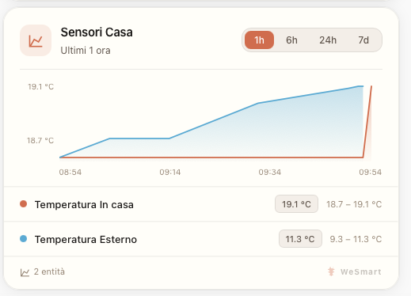

```yaml
type: custom:wesmart-chart-card
title: Temperature
color: '#D97757'
theme: dark
hours: 24
entities:
  - entity: sensor.temperatura_soggiorno
    name: Living Room
  - entity: sensor.temperatura_cucina
    name: Kitchen
```

**Features:** drag-to-zoom (in-memory, no re-fetch) · double-click reset · hover tooltip with time + values · Y-axis min/max labels · optional grid lines · legend with current state + min–max range

---

#### WeSmart Weather Card

Full weather card: current conditions, hourly or daily forecast strip, and stats bar.
Fetches forecasts via WebSocket API (HA 2023.9+).

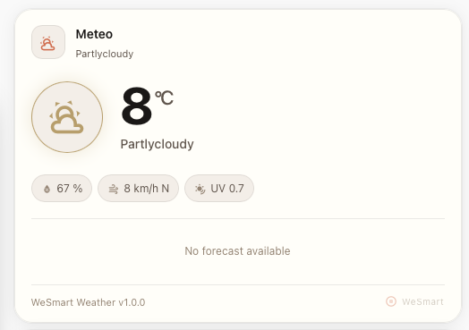
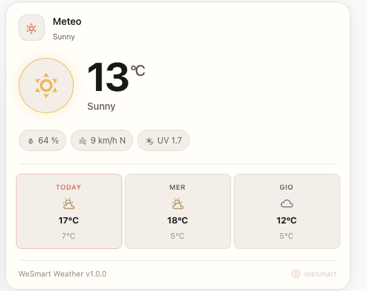

---

#### WeSmart Energy Flow Card

Real-time energy flow visualization: grid, solar, battery, home consumption. All source nodes are optional — only `home_power` is required.

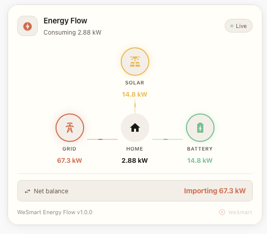

---

#### WeSmart Media Player Card

Blurred album art background, animated progress bar, full transport controls (shuffle, previous, play/pause, next, repeat), volume slider, source selector. Respects HA `supported_features` bitmask.

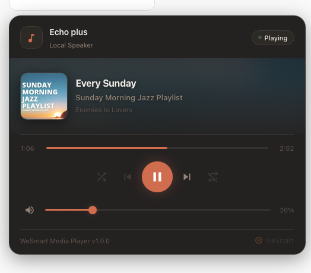


---

#### WeSmart Commander Hub

The flagship central dashboard card. Smart greeting, tabbed navigation, and automated system alerts (lights on, open locks, low batteries).

---

#### WeSmart Light Card

Single light entity with full controls: toggle, brightness, color temperature (Kelvin), and hue slider. Auto-detects supported capabilities from `supported_color_modes`.

---

#### WeSmart Lights & Lights Expand

Multiple light entities in a compact list. The Expand variant shows animated inline sliders per row (brightness + CT) without leaving the dashboard.


---

#### WeSmart Climate & Climate Compact

Advanced climate control with target temperature, HVAC modes, and fan speed. Compact version shows multiple thermostats in a list.


---

#### WeSmart Sensors & Doors

Compact lists for environmental sensors (with configurable alert thresholds) and binary sensors (doors, windows, motion) with colored status pills.


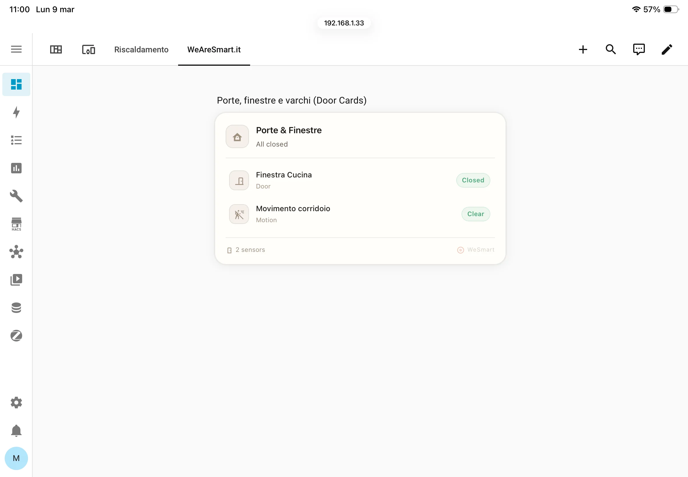

---

#### WeSmart Switches

Toggle list for `switch.*` entities with icon + ON/OFF pill. Icon click toggles, row click opens More Info.

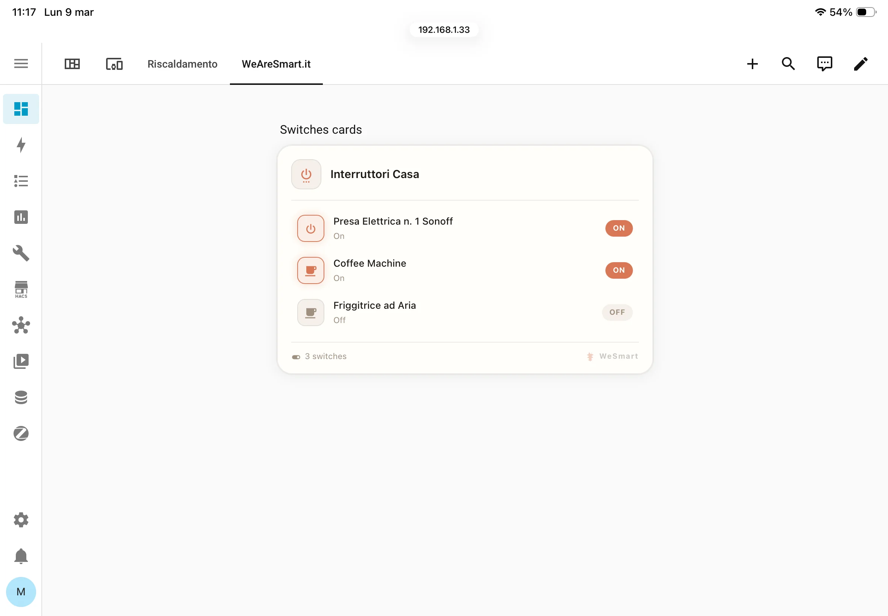

---

#### WeSmart History Card

Interactive history graphs: timeline bars for binary sensors, SVG line charts for numeric sensors. Time range pills `1h · 6h · 24h · 7d`.

---

#### WeSmart Buttons (Bar & Grid)

Quick-access buttons for lights, scenes, switches, and service calls — arranged in a horizontal bar or an auto-columns grid.

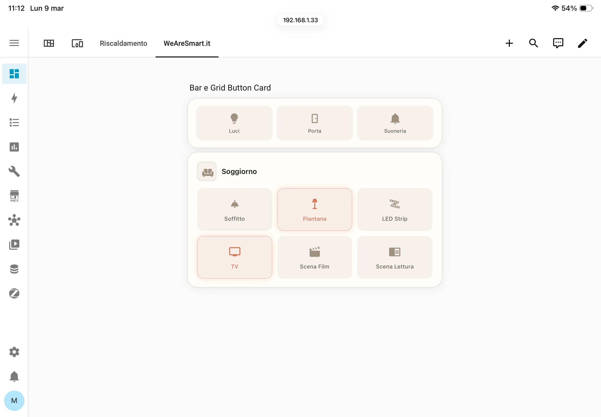

---

#### WeSmart Battery Status

Monitor all your devices with circular SVG rings or linear progress bar indicators. Color-coded: green · amber warning · orange critical.

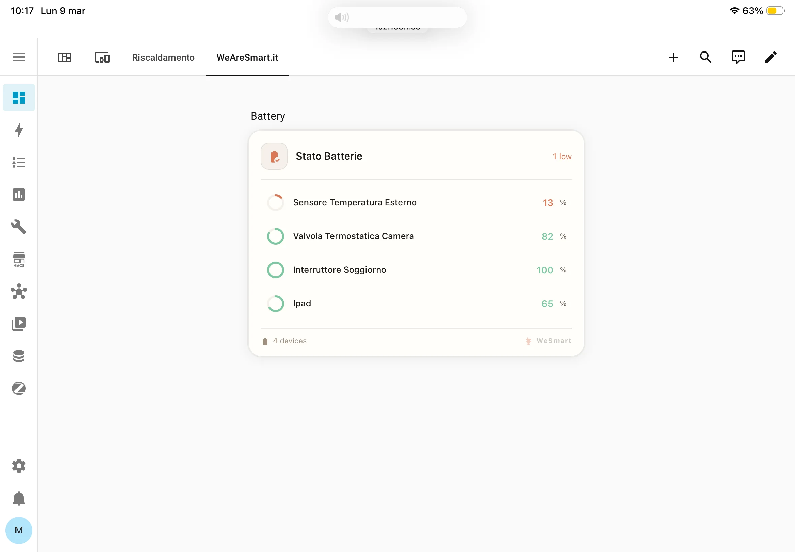

---

#### WeSmart Clock Card

Sleek ambient clock with entity info in a bottom bar or sidebar column (up to 3 extra entities).

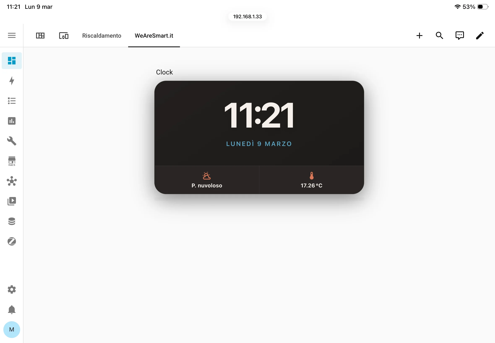

---

### ⚗️ WeSmart Labs Collection

> **⚠️ EXPERIMENTAL — Do not use in production.**
>
> These cards are proofs of concept and active design experiments.
> They **may contain bugs**, incomplete features, and breaking YAML changes without notice.
> No backwards compatibility is guaranteed.

The Labs collection explores new layout concepts and interaction patterns beyond the standard card metaphor.

**→ [Full Labs documentation](WeSmart-Labs/README.md)**

---

#### Home Panel (`wesmart-labs-home-panel`)

A dense tablet dashboard in a single card covering five rows: weather + presence, KPI tiles, light controls, climate + security, system updates + AI tasks. All sections are YAML-configured.

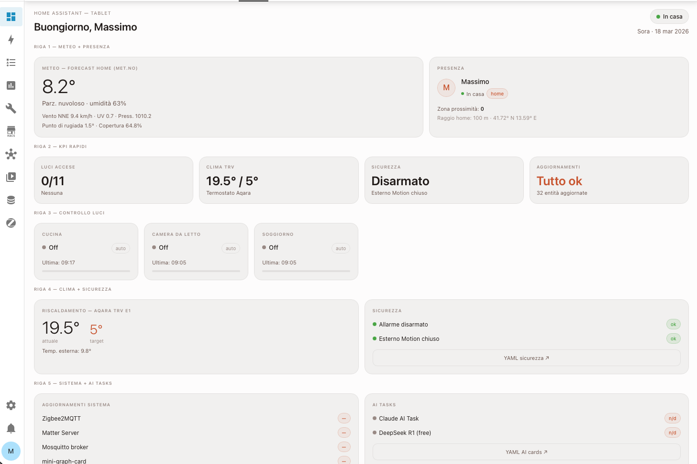

---

#### Clean Panel (`wesmart-labs-clean-panel`)

A refined overview card inspired by the Anthropic / Claude AI light aesthetic. Weather and climate side by side, interactive light rows with brightness bar and color-temperature badge, door chip grid.

---

#### Surface (`wesmart-labs-surface`)

**The cardless dashboard.** Eliminates the card container entirely — content floats directly on the background. Hierarchy expressed only through scale, weight, color, and whitespace. A single thin accent gradient rule is the only decoration. Light rows bleed to the panel edges on hover.

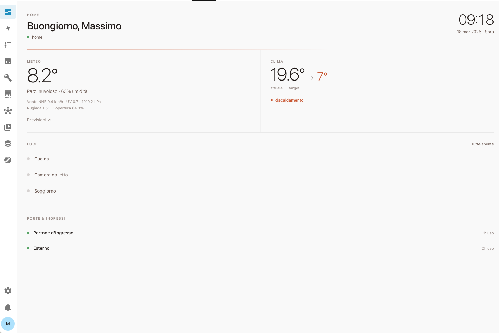

---

#### Cross Pad (`wesmart-labs-cross-pad`)

**The transparent button pad.** No card shell, no border. A single thin cross — one vertical line, one horizontal line — divides the space into four pressable quadrants. Each quadrant: icon, label, entity toggle or service call or navigation.

---

| Labs Card | YAML Tag | Status |
|-----------|----------|--------|
| Home Panel | `wesmart-labs-home-panel` | ⚗️ Experimental |
| Clean Panel | `wesmart-labs-clean-panel` | ⚗️ Experimental |
| Surface | `wesmart-labs-surface` | ⚗️ Experimental |
| Cross Pad | `wesmart-labs-cross-pad` | ⚗️ Experimental |

---

## Project Structure

```
.
├── WeSmart-Original/        # Fixed palette cards
│   ├── Hub/                 # Commander Hub, Super Dashboard
│   ├── Light/               # Single light card
│   ├── Lights/              # Lights list + Lights Expand
│   ├── Climate/             # Climate + Climate Compact
│   ├── Sensors/             # Sensors card
│   ├── Doors/               # Doors card
│   ├── Switches/            # Switches card
│   ├── Buttons/             # Bar + Grid button cards
│   ├── Battery/             # Battery status card
│   ├── Clock/               # Clock card
│   ├── History/             # History graph card
│   ├── Weather/             # Weather card
│   ├── Energy/              # Energy flow card
│   ├── MediaPlayer/         # Media player card
│   └── Chart/               # Chart card (new)
│
├── WeSmart-InfiniteColor/   # Dynamic HSL color engine cards
│   ├── History/
│   ├── Light/ Lights/ Climate/ ...
│   └── Chart/               # Infinite Chart card (new)
│
├── WeSmart-Labs/            # ⚗️ Experimental
│   ├── wesmart-labs-home-panel.js
│   ├── wesmart-labs-clean-panel.js
│   ├── wesmart-labs-surface.js
│   └── wesmart-labs-cross-pad.js
│
├── asset/
│   ├── images/              # Preview screenshots
│   └── video/               # Demo videos
│
└── doc/
    └── README.md            # Full technical documentation
```

---

## Architecture

All cards follow the same pattern:

```
Single JS file (IIFE)
  └─ class extends HTMLElement
      ├─ attachShadow({ mode: 'open' })   → isolated DOM + styles
      ├─ setConfig(config)                → parse YAML, call _render()
      ├─ set hass(hass)                   → receive state updates, call _updateState()
      ├─ _render()                        → inject <style> + HTML into shadow DOM
      ├─ _updateState()                   → update DOM from hass.states
      └─ _bindEvents()                    → add click/pointer listeners

customElements.define('wesmart-*-card', ...)
window.customCards.push({ type, name, description })
```

No build step. No dependencies. Pure vanilla JS.

---

*Inspired by the WeSmart AI aesthetic.*
