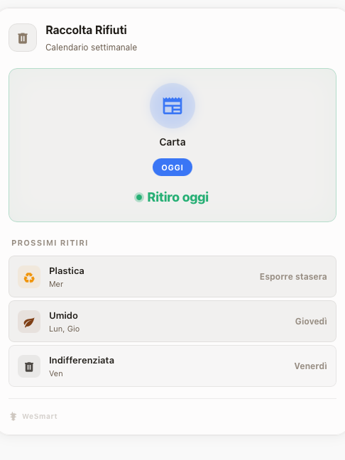
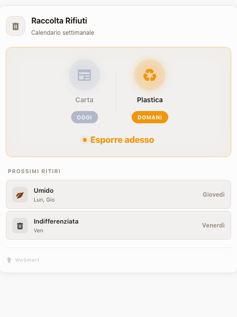

# WeSmart Infinite Garbage Card

Card per il calendario della raccolta differenziata porta a porta. Funziona in modo **completamente autonomo senza bisogno di sensori** o integrazioni aggiuntive in Home Assistant (come `waste_collection_schedule`). Si basa semplicemente sulla programmazione settimanale definita nello YAML.

Sfrutta l'**Infinite Color Engine** per generare l'interfaccia (sfondi, testi, ombre), ma permette di definire colori specifici e personalizzati (`waste_color`) per ogni tipo di rifiuto.

| Prima delle 18:00 | Dopo le 18:00 |
|---|---|
|  |  |

## Come Funziona

L'interfaccia è divisa in due blocchi:

1. **Hero Section:** Mostra sempre i ritiri di **oggi** e **domani** affiancati. I due gruppi sono separati da un divisore verticale. Se è già sera (dopo le 18:00) e il ritiro oggi è già avvenuto o in corso, il gruppo "oggi" sfuma in grigio cedendo il focus visivo a "domani".
2. **Lista Futuri:** Sotto l'hero, elenca in ordine cronologico tutti i ritiri da **dopodomani** in poi, con testo contestuale sulla riga.

### Sistema a Fasi

La card determina automaticamente la fase in base al giorno e all'orario corrente. La soglia serale è **18:00** (fissa, nessuna configurazione richiesta).

| Fase | Condizione | Testo hero / riga lista | Segnale visivo |
|------|------------|-------------------------|----------------|
| `soon` | Raccolta tra 2+ giorni | "Prossimo: [giorno]" | Nessuno |
| `tonight` | Raccolta domani, prima delle 18:00 | "Esporre stasera" | Testo attenuato |
| `urgent` | Raccolta domani, dopo le 18:00 | "Esporre adesso" | Testo amber + dot pulsante + bordo warm — gruppo oggi diventa grigio |
| `today` | Giorno della raccolta | "Ritiro oggi" | Testo verde + dot verde + bordo verde soft |

La card si aggiorna automaticamente al cambio di giorno e quando si supera la soglia delle 18:00, senza bisogno di configurazione aggiuntiva.

## Configurazione YAML

```yaml
type: custom:wesmart-infinite-garbage-card
title: Raccolta Rifiuti
color: '#A09080' # Colore base neutro consigliato per l'interfaccia
theme: auto
schedule:
  - name: Umido
    icon: mdi:leaf
    waste_color: '#8B4513' # Marrone
    days: [1, 4] # Lunedì = 1, Giovedì = 4
  - name: Plastica
    icon: mdi:recycle
    waste_color: '#F59E0B' # Giallo/Ambra
    days: [3]    # Mercoledì
  - name: Carta
    icon: mdi:newspaper
    waste_color: '#3B82F6' # Blu
    days: [2]    # Martedì
  - name: Indifferenziata
    icon: mdi:trash-can
    waste_color: '#57534E' # Grigio
    days: [5]    # Venerdì
```

## Opzioni Principali

| Opzione | Tipo | Default | Descrizione |
|---------|------|---------|-------------|
| `title` | string | `'Raccolta Rifiuti'` | Titolo della card |
| `icon` | string | `mdi:trash-can` | Icona nell'header |
| `color` | string | `'#A09080'` | Colore esadecimale base da cui viene generata la palette |
| `theme` | string | `'dark'` | `dark` \| `light` \| `auto` |
| `schedule` | list | — | **Obbligatorio.** Lista dei rifiuti e dei giorni di ritiro |

## Parametri `schedule`

Per ogni elemento nella lista `schedule`:

| Campo | Tipo | Descrizione |
|-------|------|-------------|
| `name` | string | Nome da visualizzare (es. "Vetro", "Umido") |
| `icon` | string | Icona MDI (es. `mdi:bottle-wine`) |
| `waste_color` | string | Colore esadecimale specifico del rifiuto |
| `days` | list / number | Array di giorni della settimana (1=Lunedì, ..., 7=Domenica) |
