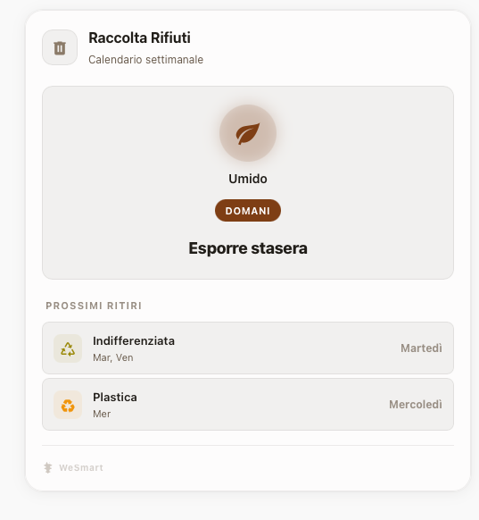

# WeSmart Infinite Garbage Card

Card per il calendario della raccolta differenziata porta a porta. Funziona in modo **completamente autonomo senza bisogno di sensori** o integrazioni aggiuntive in Home Assistant (come `waste_collection_schedule`). Si basa semplicemente sulla programmazione settimanale definita nello YAML.

Sfrutta l'**Infinite Color Engine** per generare l'interfaccia (sfondi, testi, ombre), ma permette di definire colori specifici e personalizzati (`waste_color`) per ogni tipo di rifiuto.



## Come Funziona

L'interfaccia è divisa in due blocchi:
1.  **Hero Section (In Evidenza):** Mostra il ritiro più imminente (Oggi o Domani). Ha un'icona grande con un anello/glow del colore specifico del rifiuto. Il testo si adatta automaticamente mostrando "Esporre oggi" o "Esporre stasera".
2.  **Lista Futuri:** Sotto l'elemento in evidenza, elenca i successivi ritiri della settimana in ordine cronologico.

## Configurazione YAML

```yaml
type: custom:wesmart-infinite-garbage-card
title: Raccolta Rifiuti
color: '#A09080' # Colore base neutro consigliato per l'interfaccia
theme: auto
schedule:
  - name: Umido
    icon: mdi:leaf
    waste_color: '#8B4513' # Marrone
    days: [1, 4] # Lunedì = 1, Giovedì = 4
  - name: Plastica
    icon: mdi:recycle
    waste_color: '#F59E0B' # Giallo/Ambra
    days: [3]    # Mercoledì
  - name: Carta
    icon: mdi:newspaper
    waste_color: '#3B82F6' # Blu
    days: [2]    # Martedì
  - name: Indifferenziata
    icon: mdi:trash-can
    waste_color: '#57534E' # Grigio
    days: [5]    # Venerdì
```

## Opzioni Principali

| Opzione | Tipo | Default | Descrizione |
|---------|------|---------|-------------|
| `title` | string | `'Raccolta Rifiuti'` | Titolo della card |
| `icon` | string | `mdi:trash-can` | Icona nell'header |
| `color` | string | `'#A09080'` | Colore esadecimale base da cui viene generata la palette |
| `theme` | string | `'dark'` | `dark` \| `light` \| `auto` |
| `schedule` | list | — | **Obbligatorio.** Lista dei rifiuti e dei giorni di ritiro |

## Parametri `schedule`

Per ogni elemento nella lista `schedule`:

| Campo | Tipo | Descrizione |
|-------|------|-------------|
| `name` | string | Nome da visualizzare (es. "Vetro", "Umido") |
| `icon` | string | Icona MDI (es. `mdi:bottle-wine`) |
| `waste_color` | string | Colore esadecimale specifico del rifiuto |
| `days` | list / number | Array di giorni della settimana (1=Lunedì, ..., 7=Domenica) |
