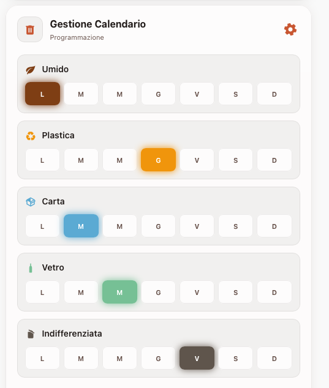

# WeSmart Garbage — Home Assistant Unified Solution

Questa soluzione completa combina un'integrazione backend (Custom Component) e una card frontend (Lovelace Card) per gestire il calendario della raccolta rifiuti con **persistenza reale** e un'interfaccia di configurazione intuitiva.



## 1. Backend: Integrazione `wesmart_garbage`

L'integrazione personalizzata gestisce il salvataggio dei dati nel database interno di Home Assistant, garantendo che le impostazioni sopravvivano ai riavvii.

### Caratteristiche
- **Persistenza Reale**: Utilizza lo `Store` di HA per salvare i dati in `/config/.storage/wesmart_garbage.json`.
- **Sensore Dinamico**: Crea l'entità `sensor.wesmart_garbage_today`.
- **Servizio Dedicato**: Espone il servizio `wesmart_garbage.update_schedule` per aggiornamenti programmatici o via card.

### Installazione Backend
1. Copia la cartella `custom_components/wesmart_garbage` nella cartella `custom_components/` del tuo Home Assistant.
2. Aggiungi la seguente configurazione al tuo `configuration.yaml`:
   ```yaml
   wesmart_garbage:
   ```
3. Riavvia Home Assistant.

---

## 2. Frontend: `wesmart-infinite-garbage-lab-card`

Una card avanzata che permette di visualizzare il ritiro di oggi e di configurare l'intero calendario settimanale direttamente dalla dashboard, senza scrivere una riga di codice.

### Caratteristiche
- **Configurazione Visuale**: Clicca sull'icona dell'ingranaggio per aprire la griglia di programmazione.
- **Motore InfiniteColor**: Palette dinamica basata sul colore scelto in configurazione.
- **Ottimizzazione UI**: Glow animati, icone dinamiche e lista dei prossimi ritiri.

### Installazione Frontend
1. Copia il file `wesmart-infinite-garbage-lab-card.js` (presente nella cartella superiore) nella cartella `www/` di HA.
2. Registra la risorsa in Dashboard -> Risorse:
   - URL: `/local/wesmart-infinite-garbage-lab-card.js`
   - Tipo: `JavaScript module`

### Esempio Configurazione YAML
```yaml
type: custom:wesmart-infinite-garbage-lab-card
title: Calendario Rifiuti
icon: mdi:trash-can
color: '#D97757'      # Colore base per la palette dinamica
theme: auto           # auto, dark, light
show_weekly_schedule: true
```

---

## 3. Servizi e Automazioni

L'integrazione espone un servizio che può essere usato anche in automazioni esterne:

**Esempio di chiamata servizio:**
```yaml
service: wesmart_garbage.update_schedule
data:
  day: 1               # 1=Lunedì, 7=Domenica
  waste_type: "Umido"
  icon: "mdi:leaf"
```

---
Creato da **Massimo Di Vona** per l'ecosistema **WeSmart Labs**.
